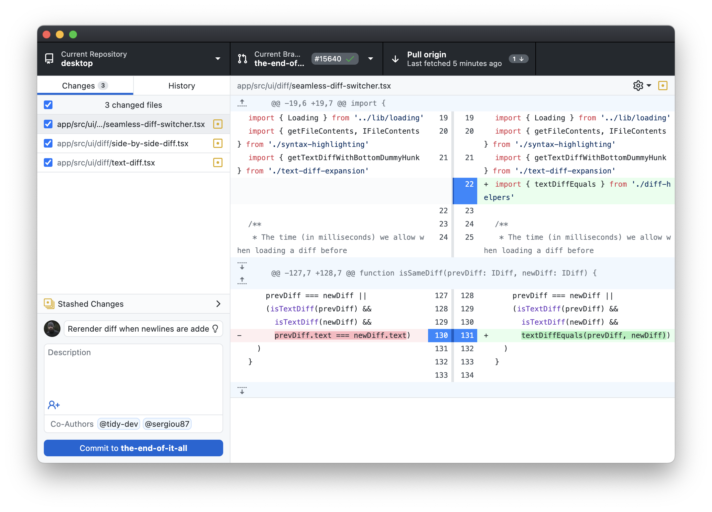

# GitHub Desktop for Linux

A Linux build of GitHub Desktop maintained for **ENSTA Robotics**.

This repository provides an easy-to-install GitHub Desktop experience for Linux users, primarily members and contributors of the ENSTA Robotics community.

> This project is based on [Desktop Plus](https://github.com/desktop-plus/desktop-plus), which itself is based on the official [GitHub Desktop](https://github.com/desktop/desktop) project.

<picture>
  <source
    srcset="docs/assets/github-dark.png"
    media="(prefers-color-scheme: dark)"
  />
  
</picture>

## Why this repository?

GitHub Desktop is officially available for Windows and macOS, but GitHub does not currently provide an official Linux release.

ENSTA Robotics primarily uses Linux for robotics development, so this repository provides a maintained Linux version that our members can install easily and use for day-to-day Git and GitHub workflows.

Our goal is simple:

- provide an accessible Git GUI for Linux users
- keep the experience close to GitHub Desktop
- provide a known version that can be tested by ENSTA Robotics
- make onboarding easier for members who are not yet comfortable with Git from the command line

## Upstream

This repository is based on the following projects:

```text
GitHub Desktop
desktop/desktop
      ↓
Desktop Plus
desktop-plus/desktop-plus
      ↓
GitHub Desktop for Linux
ENSTARobotics/github-desktop-linux
```

We intentionally keep our changes as small as possible so that updates from upstream can be integrated easily.

## Installation

### Ubuntu / Debian

Download the latest `.deb` package from the [Releases](https://github.com/ENSTARobotics/github-desktop-linux/releases/latest) page.

Then install it with:

```bash
sudo apt install ./github-desktop-linux-*.deb
```

If necessary, you can also install a downloaded package with:

```bash
sudo dpkg -i github-desktop-linux-*.deb
sudo apt install -f
```

### AppImage

If an AppImage is provided with the release:

```bash
chmod +x GitHubDesktopLinux-*.AppImage
./GitHubDesktopLinux-*.AppImage
```

For Ubuntu and Debian-based systems, the `.deb` package is recommended.

## Supported systems

The main target platforms are:

- Ubuntu 22.04 LTS
- Ubuntu 24.04 LTS
- Debian-based Linux distributions
- x86_64

Additional distributions and architectures may work depending on upstream support, but are not necessarily tested by ENSTA Robotics.

## What can I do with it?

The application provides a graphical interface for common Git and GitHub operations, including:

- clone repositories
- create repositories
- commit changes
- push and pull
- fetch remote changes
- create and switch branches
- merge branches
- inspect file changes and diffs
- work with private GitHub repositories
- authenticate with GitHub

Desktop Plus also provides additional features beyond the official GitHub Desktop application.

## Updating

Updates are published through GitHub Releases.

Before recommending a new version to all ENSTA Robotics members, maintainers may validate the release on the Linux environments commonly used by the club.

You can find the latest release here:

[https://github.com/ENSTARobotics/github-desktop-linux/releases/latest](https://github.com/ENSTARobotics/github-desktop-linux/releases/latest)

## Development

Clone the repository:

```bash
git clone https://github.com/ENSTARobotics/github-desktop-linux.git
cd github-desktop-linux
```

Install the dependencies:

```bash
corepack enable
yarn
```

Build and start the development version:

```bash
yarn build:dev
yarn start
```

For more detailed development instructions, refer to the upstream [Desktop Plus](https://github.com/desktop-plus/desktop-plus) documentation.

## Contributing

Contributions are welcome.

For ENSTA Robotics-specific changes, open an issue or pull request in this repository.

For bugs or features that also affect Desktop Plus, consider reporting or contributing them directly upstream:

[https://github.com/desktop-plus/desktop-plus](https://github.com/desktop-plus/desktop-plus)

For issues affecting the original GitHub Desktop application:

[https://github.com/desktop/desktop](https://github.com/desktop/desktop)

## Maintenance policy

This repository is intended to remain as close as practical to Desktop Plus upstream.

ENSTA Robotics-specific changes should preferably be limited to:

- Linux packaging
- release automation
- documentation
- compatibility fixes
- configuration required for ENSTA Robotics users

Large application-level changes should generally be contributed upstream whenever possible.

## License

This project is distributed under the MIT License.

See [LICENSE](LICENSE) for details.

GitHub Desktop and related trademarks belong to GitHub, Inc.

This repository is not affiliated with, sponsored by, or endorsed by GitHub.

## Acknowledgements

This project builds upon the work of:

- [GitHub Desktop](https://github.com/desktop/desktop)
- [Desktop Plus](https://github.com/desktop-plus/desktop-plus)

Thanks to their contributors for making this project possible.
